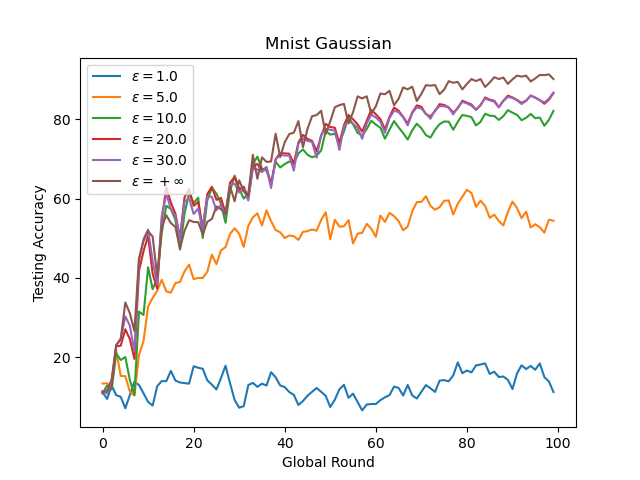

<h1 align="center">Differentially Private FL </h1>
<div align="center"> 
<h3>
Languages:
<a href="https://github.com/wenzhu23333/Differential-Privacy-Based-Federated-Learning/blob/master/README.md">
      English
</a>
<span> | </span>
<a href="https://github.com/wenzhu23333/Differential-Privacy-Based-Federated-Learning/blob/master/README_CN.md">
      Chinese
</a>
</h3>
</div>
This repository collects related papers and corresponding codes on DP-based FL.

## Code
Tip: the code of this repository is my personal implementation, if there is an inaccurate place please contact me, welcome to discuss with each other. The FL code of this repository is based on this [repository](https://github.com/wenzhu23333/Federated-Learning) .I hope you like it and support it. Welcome to submit PR to improve the  repository.

Note that in order to ensure that each client is selected a fixed number of times (to compute privacy budget each time the client is selected), this code uses round-robin client selection, which means that each client is selected sequentially.

Important note: The number of FL local update rounds used in this code is all 1, please do not change, once the number of local iteration rounds is changed, the sensitivity in DP needs to be recalculated, the upper bound of sensitivity will be a large value, and the privacy budget consumed in each round will become a lot, so please use the parameter setting of Local epoch = 1.

### Parameter List

**Datasets**: MNIST, Cifar-10, FEMNIST, Fashion-MNIST, Shakespeare.

**Model**: CNN, MLP, LSTM for Shakespeare

**DP Mechanism**: Laplace, Gaussian(Simple Composition), Gaussian(*moments* accountant)

**DP Parameter**: $\epsilon$ and $\delta$

**DP Clip**: In DP-based FL, we usually clip the gradients in training and the clip is an important parameter to calculate the sensitivity.

### Example Mnist Gaussian Mechanism

Experiments: bash run.sh

Drawing: python3 draw.py



### No DP

```shell
python main.py --dataset mnist --model cnn --dp_mechanism no_dp
```
### Gaussian Mechanism

#### Simple Composition

Based on Simple Composition in DP. 

In other words, if a client's privacy budget is $\epsilon$ and the client is selected $T$ times, the client's budget for each noising is $\epsilon / T$.

```shell
python main.py --dataset mnist --model cnn --dp_mechanism Gaussian --dp_epsilon 10 --dp_delta 1e-5 --dp_clip 10
```

#### Moments Accountant

We use [Tensorflow Privacy](https://github.com/tensorflow/privacy) to calculate noise scale of the Moment Account(MA) for Gaussian Mechanism.

```shell
python main.py --dataset mnist --model cnn --dp_mechanism MA --dp_epsilon 10 --dp_delta 1e-5 --dp_clip 10
```
See the paper for detailed mechanism. 

Abadi, Martin, et al. "Deep learning with differential privacy." *Proceedings of the 2016 ACM SIGSAC conference on computer and communications security*. 2016.

### Laplace Mechanism

Based on Simple Composition in DP. 

```shell
python main.py --dataset mnist --model cnn --dp_mechanism Laplace --dp_epsilon 10 --dp_clip 10
```


## Papers

- Reviews
  - Rodríguez-Barroso, Nuria, et al. "[Federated Learning and Differential Privacy: Software tools analysis, the Sherpa. ai FL framework and methodological guidelines for preserving data privacy.](https://www.sciencedirect.com/science/article/pii/S1566253520303213)" *Information Fusion* 64 (2020): 270-292.
- Gaussian Mechanism
  - Wei, Kang, et al. "[Federated learning with differential privacy: Algorithms and performance analysis.](https://ieeexplore.ieee.org/document/9069945)" *IEEE Transactions on Information Forensics and Security* 15 (2020): 3454-3469.
  - Y. Zhou, et al.,"[Optimizing the Numbers of Queries and Replies in Convex Federated Learning with Differential Privacy](https://ieeexplore.ieee.org/document/10008087/)" in IEEE Transactions on Dependable and Secure Computing, 2023.
  - Geyer, Robin C., Tassilo Klein, and Moin Nabi. "[Differentially private federated learning: A client level perspective.](https://arxiv.org/abs/1712.07557)" *arXiv preprint arXiv:1712.07557* (2017).
  - Seif, Mohamed, Ravi Tandon, and Ming Li. "[Wireless federated learning with local differential privacy.](https://arxiv.org/abs/2002.05151)" *2020 IEEE International Symposium on Information Theory (ISIT)*. IEEE, 2020.
  - Mohammadi, Nima, et al. "[Differential privacy meets federated learning under communication constraints.](https://ieeexplore.ieee.org/document/9511628)" *IEEE Internet of Things Journal* (2021).
  - Truex, Stacey, et al. "[A hybrid approach to privacy-preserving federated learning.](https://dl.acm.org/doi/10.1145/3338501.3357370)" *Proceedings of the 12th ACM workshop on artificial intelligence and security*. 2019.
  - Naseri, Mohammad, Jamie Hayes, and Emiliano De Cristofaro. "[Toward robustness and privacy in federated learning: Experimenting with local and central differential privacy.](https://arxiv.org/abs/2009.03561)" *arXiv e-prints* (2020): arXiv-2009.
  - Malekzadeh, Mohammad, et al. "[Dopamine: Differentially private federated learning on medical data.](https://arxiv.org/abs/2101.11693)" *arXiv preprint arXiv:2101.11693* (2021).
- Laplace Mechanism
  - Wu, Nan, et al. "[The value of collaboration in convex machine learning with differential privacy.](https://www.computer.org/csdl/proceedings-article/sp/2020/349700a485/1j2LfLp7Sik)" *2020 IEEE Symposium on Security and Privacy (SP)*. IEEE, 2020.
  - Y. Zhou, et al.,"[Optimizing the Numbers of Queries and Replies in Convex Federated Learning with Differential Privacy](https://ieeexplore.ieee.org/document/10008087/)" in IEEE Transactions on Dependable and Secure Computing, 2023.
  - L. Cui, J. Ma, Y. Zhou and S. Yu, "[Boosting Accuracy of Differentially Private Federated Learning in Industrial IoT With Sparse Responses,](https://ieeexplore.ieee.org/document/9743613/)" in IEEE Transactions on Industrial Informatics, 2023. 
  - Liu, Xiaoyuan, et al. "[Adaptive privacy-preserving federated learning.](https://link.springer.com/article/10.1007/s12083-019-00869-2)" *Peer-to-Peer Networking and Applications* 13.6 (2020): 2356-2366.
  - Zhao, Yang, et al. "[Local differential privacy-based federated learning for internet of things.](https://ieeexplore.ieee.org/document/9253545/)" *IEEE Internet of Things Journal* 8.11 (2020): 8836-8853.
  - Fu, Yao, et al. "[On the practicality of differential privacy in federated learning by tuning iteration times.](https://arxiv.org/abs/2101.04163)" *arXiv preprint arXiv:2101.04163* (2021).
- Other Mechanism
  - Zhao, Yang, et al. "[Local differential privacy-based federated learning for internet of things.](https://ieeexplore.ieee.org/document/9253545/)" *IEEE Internet of Things Journal* 8.11 (2020): 8836-8853.
  - Truex, Stacey, et al. "[LDP-Fed: Federated learning with local differential privacy.](https://dl.acm.org/doi/abs/10.1145/3378679.3394533)" *Proceedings of the Third ACM International Workshop on Edge Systems, Analytics and Networking*. 2020.
  - Yang, Jungang, et al. "[Matrix Gaussian Mechanisms for Differentially-Private Learning.](https://ieeexplore.ieee.org/document/9475590)" *IEEE Transactions on Mobile Computing* (2021).
  - Sun, Lichao, Jianwei Qian, and Xun Chen. "[Ldp-fl: Practical private aggregation in federated learning with local differential privacy.](https://www.ijcai.org/proceedings/2021/217)" *arXiv preprint arXiv:2007.15789* (2020).
  - Liu, Ruixuan, et al. "[Fedsel: Federated sgd under local differential privacy with top-k dimension selection.](https://link.springer.com/chapter/10.1007/978-3-030-59410-7_33)" *International Conference on Database Systems for Advanced Applications*. Springer, Cham, 2020.  

## Remark

The new version uses [Opacus](https://opacus.ai/) for **Per Sample Gradient Clip**, which limits the norm of the gradient calculated by each sample.

This code sets the number of local training rounds to 1, and the batch size is the local data set size of the client. 
Since the training of the Opacus library will save the gradient of all samples, the gpu memory usage is very large during training.
This problem can be solved by specifying **--serial** and **--serial_bs** parameters. 

These two parameters will physically specify a virtual batch size, and the corresponding training time will be longer, but logically will not affect the training and the addition of DP noise. The main reason for this is to not violate the theory of DP noise addition.

The Dev branch is still being improved, and new DPFL algorithms including MA, F-DP, and Shuffle are implemented in it. Interested friends are welcome to give valuable advice!
