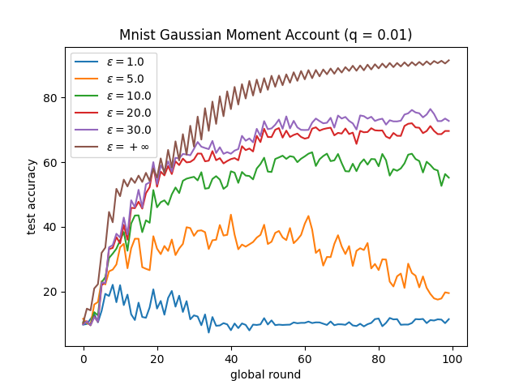
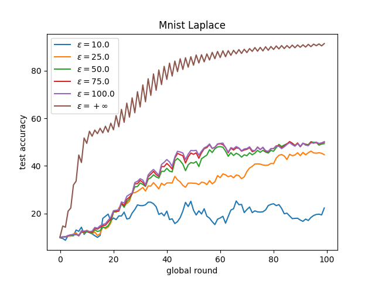

<h1 align="center">基于差分隐私的联邦学习</h1>
<div align="center"> 
<h3>
语言:
<a href="https://github.com/wenzhu23333/Differential-Privacy-Based-Federated-Learning/blob/master/README.md">
      English
</a>
<span> | </span>
<a href="https://github.com/wenzhu23333/Differential-Privacy-Based-Federated-Learning/blob/master/README_CN.md">
      简体中文
</a>
</h3>
</div>

本仓库收集了基于差分隐私的联邦学习的相关论文、以及相应代码。

## 代码

提示：本仓库的代码均为本人个人实现，如有不准确的地方请联系本人，欢迎互相讨论。 本仓库的FL代码是基于 [这个仓库](https://github.com/wenzhu23333/Federated-Learning) 实现的，希望大家都能点赞多多支持，欢迎大家提交PR完善，谢谢！

注意，为了保证每个客户端被选中的次数是固定的（为了计算机每一次消耗的隐私预算），本代码使用了**Round-robin**的选择客户端机制，也就是说每个client是都是被顺序选择的。 

(重要提示：本代码使用的FL**本地更新轮数均为1**，请勿更改，一旦更改本地迭代轮数，DP中的敏感度需要重新计算，敏感度上界会是一个很大的值，每一轮消耗的隐私预算会变得很多，请使用local epoch = 1的参数设置。)

### 参数列表

**数据集**: MNIST, Cifar-10, FEMNIST, Fashion-MNIST, Shakespeare.

**模型**: CNN, MLP, LSTM for Shakespeare

**DP机制**: Laplace, Gaussian(Simple Composition), Gaussian(*moments* accountant)

**DP参数**: $\epsilon$ and $\delta$

**DP裁剪**: 在机器学习任务中，为了计算敏感度，通常情况下需要对梯度进行裁剪，限制梯度的一范数或者二范数的值。

### 运行样例

实验环境：MNIST、高斯机制（Simple合成定理、Moment Account机制）、拉普拉斯机制。

实验命令: 
```shell
bash run.sh
```

绘图命令: 
```shell
python3 draw.py
```

#### Gaussian (Simple Composition)


#### Gaussian (Moment Account)



#### Laplace



### 无噪声的FL

```shell
python main.py --dataset mnist --iid --model cnn --epochs 50 --dp_mechanism no_dp
```
### 高斯机制

#### Simple合成定理

基于DP中的Simple Composition。

也就是说，如果某个客户端的隐私预算是 $\epsilon$ ，这个客户端被选中 $T$ 次的话，那么该客户端每次加噪使用的预算为 $\epsilon / T$。

```shell
python main.py --dataset mnist --model cnn --epochs 50 --dp_mechanism Gaussian --dp_epsilon 10 --dp_delta 1e-5 --dp_clip 10
```

#### Moments Accountant

本仓库使用[Tensorflow Privacy](https://github.com/tensorflow/privacy)来计算基于Gaussian Mechanism的Moment Account(MA)的噪声标准差。

```shell
python main.py --dataset mnist --model cnn --dp_mechanism MA --dp_epsilon 10 --dp_delta 1e-5 --dp_clip 10 --dp_sample 0.01
```
以下论文可以提供更多信息。

Abadi, Martin, et al. "Deep learning with differential privacy." *Proceedings of the 2016 ACM SIGSAC conference on computer and communications security*. 2016.

### Laplace Mechanism

基于DP中的Simple Composition。

```shell
python main.py --dataset mnist --model cnn --epochs 50 --dp_mechanism Laplace --dp_epsilon 30 --dp_clip 50
```

## 论文

- 综述
  - Rodríguez-Barroso, Nuria, et al. "[Federated Learning and Differential Privacy: Software tools analysis, the Sherpa. ai FL framework and methodological guidelines for preserving data privacy.](https://www.sciencedirect.com/science/article/pii/S1566253520303213)" *Information Fusion* 64 (2020): 270-292.
- 高斯机制
  - Wei, Kang, et al. "[Federated learning with differential privacy: Algorithms and performance analysis.](https://ieeexplore.ieee.org/document/9069945)" *IEEE Transactions on Information Forensics and Security* 15 (2020): 3454-3469.
  - Y. Zhou, et al.,"[Optimizing the Numbers of Queries and Replies in Convex Federated Learning with Differential Privacy](https://ieeexplore.ieee.org/document/10008087/)" in IEEE Transactions on Dependable and Secure Computing, 2023.
  - K. Wei, et al.,"[User-Level Privacy-Preserving Federated Learning: Analysis and Performance Optimization](https://ieeexplore.ieee.org/document/9347706)" in IEEE Transactions on Mobile Computing, vol. 21, no. 09, pp. 3388-3401, 2022.
  - Geyer, Robin C., Tassilo Klein, and Moin Nabi. "[Differentially private federated learning: A client level perspective.](https://arxiv.org/abs/1712.07557)" *arXiv preprint arXiv:1712.07557* (2017).
  - Seif, Mohamed, Ravi Tandon, and Ming Li. "[Wireless federated learning with local differential privacy.](https://arxiv.org/abs/2002.05151)" *2020 IEEE International Symposium on Information Theory (ISIT)*. IEEE, 2020.
  - Mohammadi, Nima, et al. "[Differential privacy meets federated learning under communication constraints.](https://ieeexplore.ieee.org/document/9511628)" *IEEE Internet of Things Journal* (2021).
  - Truex, Stacey, et al. "[A hybrid approach to privacy-preserving federated learning.](https://dl.acm.org/doi/10.1145/3338501.3357370)" *Proceedings of the 12th ACM workshop on artificial intelligence and security*. 2019.
  - Naseri, Mohammad, Jamie Hayes, and Emiliano De Cristofaro. "[Toward robustness and privacy in federated learning: Experimenting with local and central differential privacy.](https://arxiv.org/abs/2009.03561)" *arXiv e-prints* (2020): arXiv-2009.
  - Malekzadeh, Mohammad, et al. "[Dopamine: Differentially private federated learning on medical data.](https://arxiv.org/abs/2101.11693)" *arXiv preprint arXiv:2101.11693* (2021).
- 拉普拉斯机制
  - Wu, Nan, et al. "[The value of collaboration in convex machine learning with differential privacy.](https://www.computer.org/csdl/proceedings-article/sp/2020/349700a485/1j2LfLp7Sik)" *2020 IEEE Symposium on Security and Privacy (SP)*. IEEE, 2020.
  - Y. Zhou, et al.,"[Optimizing the Numbers of Queries and Replies in Convex Federated Learning with Differential Privacy](https://ieeexplore.ieee.org/document/10008087/)" in IEEE Transactions on Dependable and Secure Computing, 2023.
  - L. Cui, J. Ma, Y. Zhou and S. Yu, "[Boosting Accuracy of Differentially Private Federated Learning in Industrial IoT With Sparse Responses,](https://ieeexplore.ieee.org/document/9743613/)" in IEEE Transactions on Industrial Informatics, 2023. 
  - Liu, Xiaoyuan, et al. "[Adaptive privacy-preserving federated learning.](https://link.springer.com/article/10.1007/s12083-019-00869-2)" *Peer-to-Peer Networking and Applications* 13.6 (2020): 2356-2366.
  - Zhao, Yang, et al. "[Local differential privacy-based federated learning for internet of things.](https://ieeexplore.ieee.org/document/9253545/)" *IEEE Internet of Things Journal* 8.11 (2020): 8836-8853.
  - Fu, Yao, et al. "[On the practicality of differential privacy in federated learning by tuning iteration times.](https://arxiv.org/abs/2101.04163)" *arXiv preprint arXiv:2101.04163* (2021).
- 其他机制
  - Zhao, Yang, et al. "[Local differential privacy-based federated learning for internet of things.](https://ieeexplore.ieee.org/document/9253545/)" *IEEE Internet of Things Journal* 8.11 (2020): 8836-8853.
  - Truex, Stacey, et al. "[LDP-Fed: Federated learning with local differential privacy.](https://dl.acm.org/doi/abs/10.1145/3378679.3394533)" *Proceedings of the Third ACM International Workshop on Edge Systems, Analytics and Networking*. 2020.
  - Yang, Jungang, et al. "[Matrix Gaussian Mechanisms for Differentially-Private Learning.](https://ieeexplore.ieee.org/document/9475590)" *IEEE Transactions on Mobile Computing* (2021).
  - Sun, Lichao, Jianwei Qian, and Xun Chen. "[Ldp-fl: Practical private aggregation in federated learning with local differential privacy.](https://www.ijcai.org/proceedings/2021/217)" *arXiv preprint arXiv:2007.15789* (2020).
  - Liu, Ruixuan, et al. "[Fedsel: Federated sgd under local differential privacy with top-k dimension selection.](https://link.springer.com/chapter/10.1007/978-3-030-59410-7_33)" *International Conference on Database Systems for Advanced Applications*. Springer, Cham, 2020.  

## 附注

新版本用了[Opacus](https://opacus.ai/)进行 **Per Sample Gradient Clip**，限制了每一条Sample计算出的梯度的范数。

本代码设置了本地训练轮数为1，并且batch size为客户端本地的数据集大小，由于Opacus库的训练会保存所有样本的梯度，因此训练时gpu显存占用非常大。
解决此问题可以通过指定 **--serial** 和 **--serial_bs** 参数。

这两个参数会从物理上指定一个虚拟的batch size，相应的训练时间会变长，但是逻辑上不会影响训练和DP噪声的添加，这么做的主要原因是为了不违背DP噪声添加的理论。

Dev分支目前还在完善中，里面实现了包括MA、F-DP、以及Shuffle等新的DPFL算法，欢迎感兴趣的朋友提出宝贵意见！

## 引用

考虑引用以下文章：

[1] W. Yang et al., "Gain Without Pain: Offsetting DP-Injected Noises Stealthily in Cross-Device Federated Learning," in IEEE Internet of Things Journal, vol. 9, no. 22, pp. 22147-22157, 15 Nov.15, 2022, doi: 10.1109/JIOT.2021.3102030.

[2] M. Hu et al., "AutoFL: A Bayesian Game Approach for Autonomous Client Participation in Federated Edge Learning," in IEEE Transactions on Mobile Computing, doi: 10.1109/TMC.2022.3227014.

[3] Y. Zhou et al., "Optimizing the Numbers of Queries and Replies in Convex Federated Learning with Differential Privacy," in IEEE Transactions on Dependable and Secure Computing, doi: 10.1109/TDSC.2023.3234599.